# <p align="center">🌌 Bem-vindo ao meu Hub Digital</p>

<p align="center">
  
</p>

<p align="center">
  <a href="#-sobre-mim"></a>
  <a href="#-stack-tecnológica"></a>
  <a href="#-dashboards"></a>
  <a href="#-conexão"></a>
</p>

---

## 👨‍💻 Sobre Mim

<table border="0">
  <tr>
    <td width="60%">
      <h3>Olá! Sou o Angel Rafael Souza Da Silva 👋</h3>
      <p align="justify">
        Sou um apaixonado por tecnologia especializado em arquitetura de software e design de interfaces. No meu dia a dia, transformo requisitos complexos em código limpo, escalável e de alto desempenho.
      </p>
      <p>
        ⚡ <b>Curiosidade:</b> Adoro explorar como a IA pode otimizar o fluxo de trabalho dos desenvolvedores.<br>
        🎯 <b>Foco:</b> Entregar soluções que unam design impecável e lógica robusta.
      </p>
    </td>
    <td width="40%" align="center">
      
    </td>
  </tr>
</table>

---

## 🛠️ Stack Tecnológica

| Front-end | Back-end | DevOps/Outros |
| :--- | :--- | :--- |
|  |  |  |
|  |  |  |
|  |  |  |
|  |  |  |

---

## 📊 Dashboards (Live Stats)

<p align="center">
  
  
</p>

### 🐍 Snake Contribution Game
<p align="center">
  
</p>

---

## 🗺️ Ciclo de Desenvolvimento

```mermaid
graph TD
  A[Pesquisa & Design UX] --> B{Codificação}
  B --> C[CI/CD & Pipeline]
  C --> D{Produção}
  D --> |Monitoramento| A
  style A fill:#7333ff,stroke:#fff,color:#fff
  style D fill:#00ff88,stroke:#000
```



---

## 🎵 Agora na PlayList
<p align="center">
  <a href="https://open.spotify.com/user/31xiahxp2kfbt737xbm7qrc3i4jm">
    
  </a>
</p>

---

## ⚡ Conexão & Redes

<p align="center">
  <a href="mailto:rafael_profissional@outlook.com">
    
  </a>
  <a href="https://linkedin.com/in/rafaelprofmgz">
    
  </a>
  <a href="https://github.com/RafaelProfMgz">
    
  </a>
</p>

<p align="center">
  
</p>

---

<p align="center">
  <i>"Programar é a arte de criar mundos do nada."</i><br>
  Copyright © 2024 - <b>Angel Rafael Souza Da Silva</b>
</p>
```

